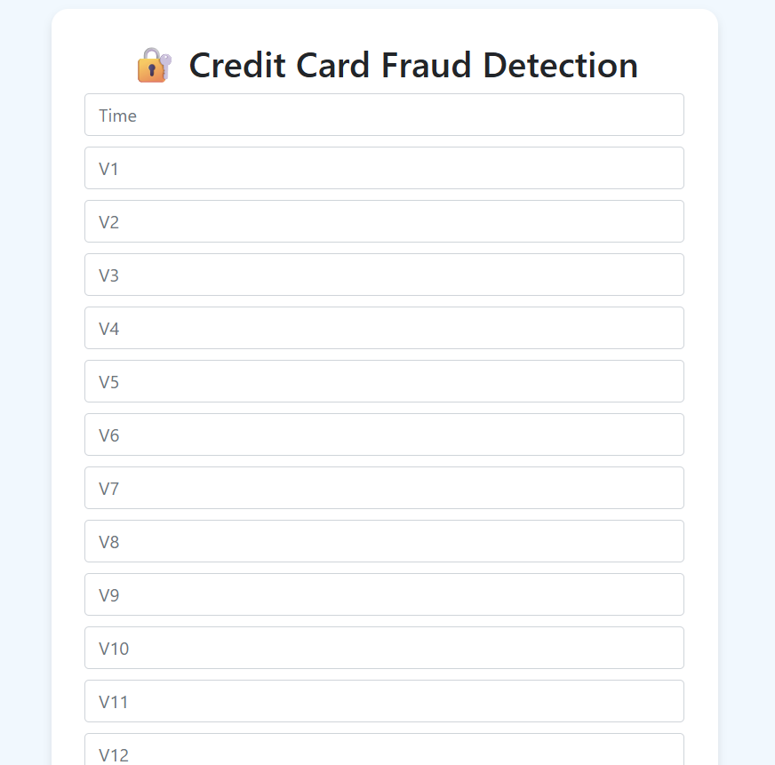
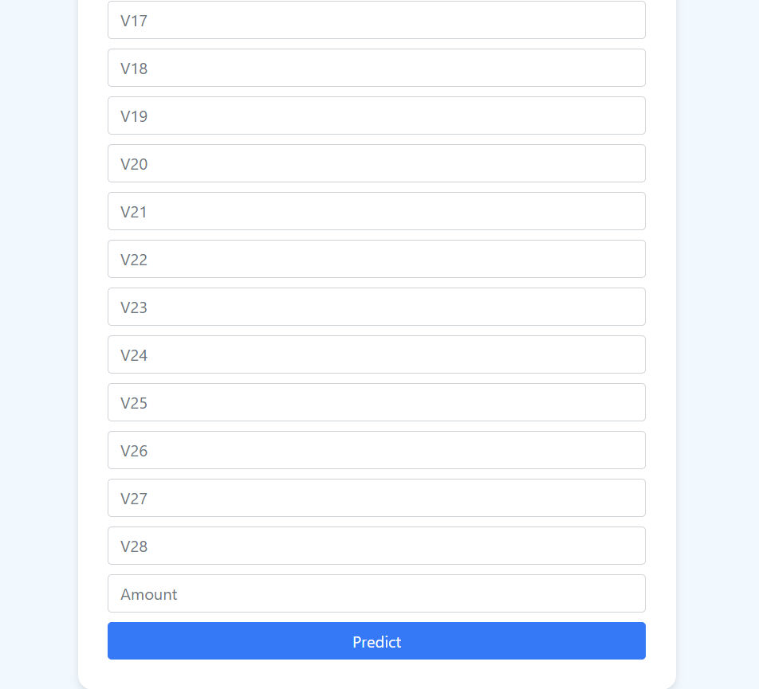
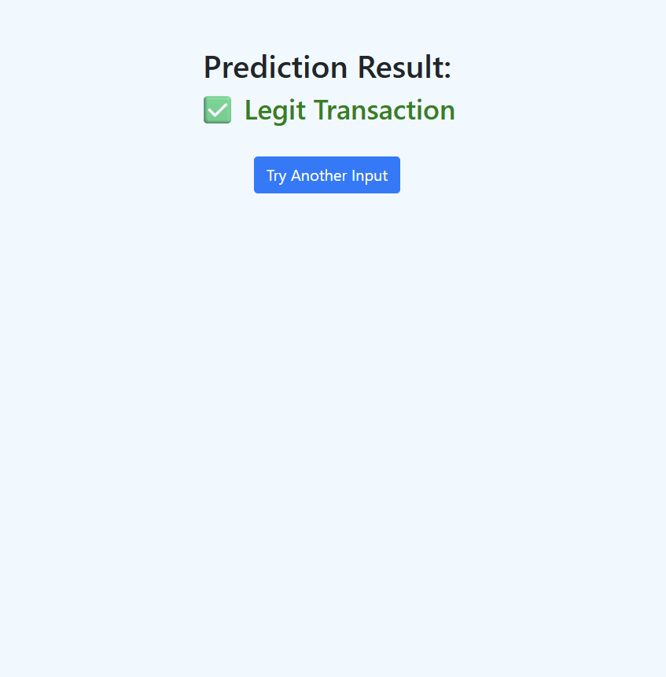

# Credit-Card-Fraud-Detection
This project aims to build a robust Credit Card Fraud Detection Model using Machine Learning (Random Forest Classifier), starting from Exploratory Data Analysis (EDA) to deployment via Flask. The workflow is built on the popular **[Kaggle Credit Card Fraud Detection Dataset](https://www.kaggle.com/datasets/mlg-ulb/creditcardfraud)**.

## Problem Statement
Credit card fraud poses significant financial risks globally.  
**Goal** → Accurately classify transactions as **Fraudulent (1)** or **Legitimate (0)**.

**Dataset Summary:**
- **Total Features:** 30  
- **Features:**
  - `Time`
  - `V1` to `V28` (PCA-transformed, anonymized)
  - `Amount`
- **Target Variable:** `Class` (0 = Legit, 1 = Fraud)

## Project Workflow

### 1. 📊 Data Understanding & EDA
- Loaded and explored the **Kaggle Credit Card Fraud dataset**.
- Identified **severe class imbalance** (Very few frauds vs legit transactions).
- Visualized distributions using:
  - **Histograms**
  - **Boxplots**
  - **Correlation Heatmaps**
- Outlier detection in key features: `V3`, `V4`, `V9`, `V10`, `V11`, etc.

### 2. Feature Engineering
- Created new features like:
  - **Transaction Hour** (from `Time`)
  - **Log-transformed Amount** (to reduce skewness)
  - **Outlier Flags** based on boxplot outlier thresholds for key `V` features.
- Dropped raw `Time` and `Amount` columns after transformation.

### 3. Handling Imbalanced Data
- Used two approaches:
  - **Undersampling** (using `RandomUnderSampler` from `imblearn`)
  - **Oversampling** (using `SMOTE`)
- Created separate datasets for both approaches and compared model performance.

### 4. Model Building & Evaluation
Trained four different models on all three data variations (Normal, Undersampled, Oversampled):

| Model | Accuracy | Precision | Recall | F1 Score | AUC |
|------ |--------- |--------- |------ |-------- |--- |
| Logistic Regression | ✅ | ✅ | ✅ | ✅ | ✅ |
| Decision Tree | ✅ | ✅ | ✅ | ✅ | ✅ |
| Random Forest | ✅ | ✅ | ✅ | ✅ | ✅ |
| XGBoost | ✅ | ✅ | ✅ | ✅ | ✅ |

 - Evaluation metrics used:
    - **Accuracy**
    - **Precision**
    - **Recall**
    - **F1 Score**
    - **AUC ROC**
    - **Precision-Recall Curve**
    - **Feature Importance (Random Forest & XGBoost)**

**Final Model Chosen**: ✅ **Random Forest on Oversampled Data**
(best balance between **recall**, **F1 score**, and **AUC**)

### 5. Model Deployment (Flask + ngrok)
- Created a **Random Forest pipeline** that includes all preprocessing steps:
  - Feature creation
  - Transformation
  - Outlier flags
- Saved using **Joblib** as `rf_credit_fraud_pipeline.pkl`.

- Built a **Flask web app** for user inputs (raw 30 features as in original dataset: Time, V1-V28, Amount).

- Setup **ngrok** for public URL tunneling.

### 6. Demo Screenshots
*🔐 Web App Input Page (Two-Column Layout):**

  
  

---

**✅ Prediction Output Page:**

  

